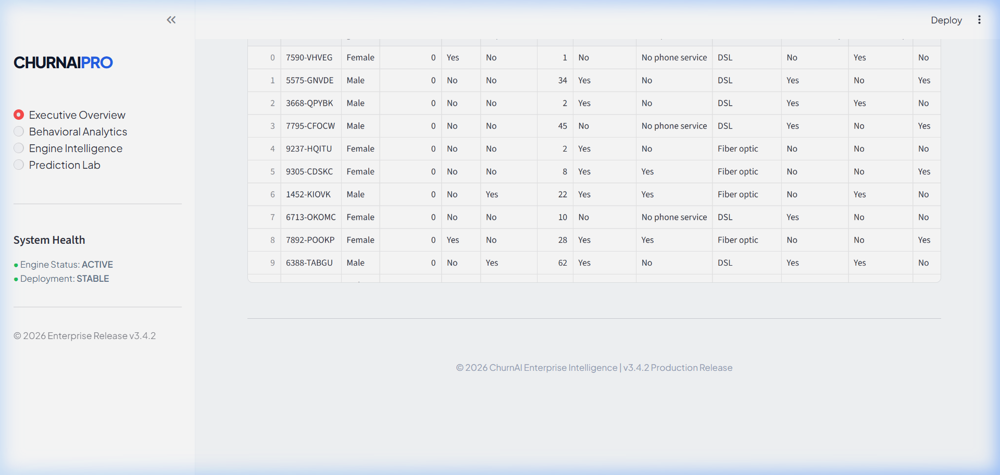
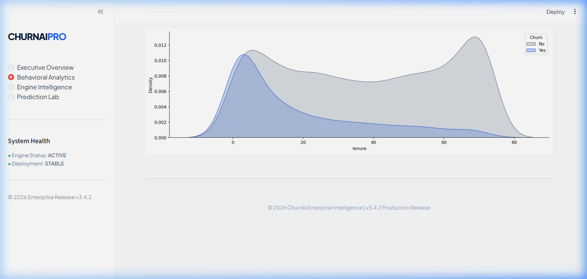
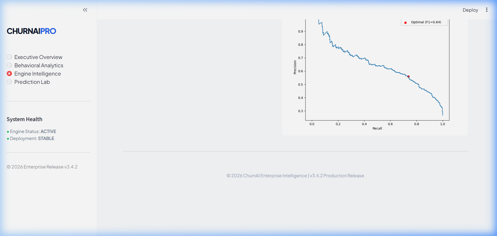
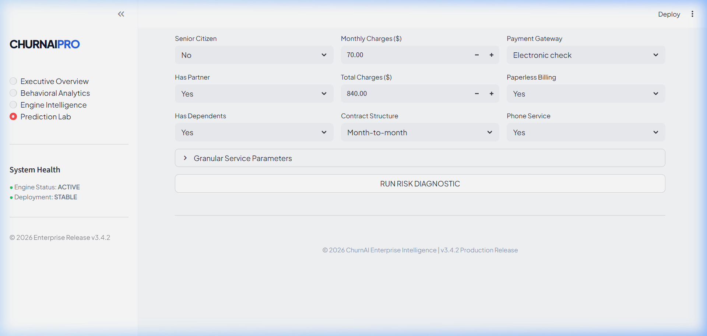

# ChurnAI Enterprise: Customer Intelligence Platform

## Overview
ChurnAI Enterprise is a production-grade machine learning platform designed to identify high-risk customer segments and predict churn with high precision. By leveraging advanced ensemble learning and automated feature engineering, this platform provides actionable intelligence to protect recurring revenue and optimize retention strategies.

## Machine Learning Engineering
This platform is built on a robust ML foundation designed for real-world business deployment:

### 1. Ensemble Pipeline
The core engine utilizes a **CatBoost Classifier**, a high-performance gradient-boosting ensemble optimized for categorical data handling and robust generalization. The model was tuned across 40 trials using **Bayesian Optimization** (Optuna) to maximize both Recall and F1-Score.

### 2. Feature Engineering & Selection
Beyond raw data, the system engineers 6 custom behavioral and financial indicators:
- **Monthly-to-Total Ratio**: Detection of sudden billing velocity changes.
- **Tenure-Monthly Interaction**: Capturing the combined effect of loyalty and spend.
- **Service Density**: Quantifying the customer's overall service ecosystem.
- **Behavioral Flags**: Identification of critical segments like Month-to-Month contracts and Fiber Optic users.

### 3. Class Imbalance Handling
To combat the historical minority of churn cases (approx. 26% of the dataset), the pipeline integrates **SMOTE** (Synthetic Minority Over-sampling Technique) strictly within the cross-validation folds to prevent data leakage while ensuring the model learns minority patterns effectively.

### 4. Decision Threshold Optimization
Instead of a default 0.5 probability cutoff, the system employs a **Calibrated Decision Boundary** optimized via Precision-Recall curves. This ensures the model captures the maximum possible churners while maintaining business-viable precision.

## Machine Learning Engineering
The platform is built on a robust ML foundation designed for real-world business deployment:

### 1. Ensemble Pipeline
The core engine utilizes a **CatBoost Classifier**, a high-performance gradient-boosting ensemble optimized for categorical data handling and robust generalization. The model was tuned using **Bayesian Optimization** (Optuna).

### 2. Feature Engineering & Selection
Beyond raw data, the system engineers custom behavioral and financial indicators:
- **Monthly-to-Total Ratio**: Detection of sudden billing velocity changes.
- **Tenure-Monthly Interaction**: Capturing the combined effect of loyalty and spend.
- **Service Density**: Quantifying the customer's overall service ecosystem.

### 3. Production Training Pipeline (`advanced_ml.py`)
The repository includes a standalone, optimized training script (`advanced_ml.py`) that encapsulates:
- Automated preprocessing and feature engineering.
- Stratified 5-fold cross-validation for stability verification.
- Decision boundary optimization via Precision-Recall curves.
- Automated artifact versioning and persistence.

## Tech Stack
- **Languages**: Python
- **Libraries**: Pandas, NumPy, Scikit-learn, CatBoost, imbalanced-learn
- **UI Framework**: Streamlit
- **Persistence**: Joblib
- **Visualization**: Matplotlib, Seaborn

## Model Performance
Optimized for high-sensitivity detection to minimize missed retention opportunities.

| Metric | Score |
| :--- | :--- |
| **Accuracy** | 78.0% |
| **Recall (Sensitivity)** | **72.7%** |
| **F1-Score** | **0.64** |
| **ROC-AUC** | 0.84 |

## Dashboard Preview

### Executive Overview


### Behavioral Analytics


### Engine Intelligence


### Prediction Lab


## Installation

### 1. Clone the Repository
```bash
git clone https://github.com/Jod729/churn-analysis-prediction.git
cd churn-analysis-prediction
```

### 2. Install Dependencies
```bash
pip install -r requirements.txt
```

### 3. Launch the Platform
```bash
# Start the Streamlit Dashboard
streamlit run app.py

# (Optional) Re-run the Advanced ML Training Pipeline
python advanced_ml.py
```

## Project Architecture
```text
├── app.py                      # Main production dashboard
├── advanced_ml.py              # Automated training & optimization pipeline
├── utils/
│   ├── helpers.py              # Centralized feature engineering
│   └── inference.py            # High-performance prediction engine
├── models/
│   └── churn_model_v3.joblib   # Persisted production artifacts
├── data/
│   └── Telco-Customer-Churn.csv # Customer intelligence dataset
└── assets/screenshots/         # Platform UI previews
```

## Business Insights
- **Contract Volatility**: Month-to-month contracts are the strongest predictor of attrition.
- **Service Synergy**: Absence of Tech Support and Online Security correlates highly with increased churn risk.
- **Stability Threshold**: Customers exceeding 12 months of tenure show significantly higher loyalty indicators.

## Author
Developed by **Jod729**.
